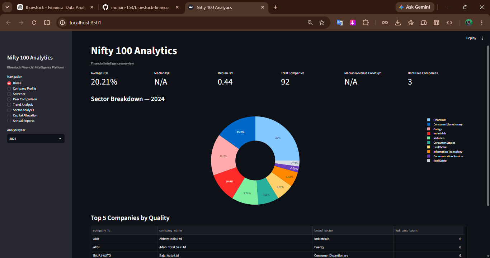
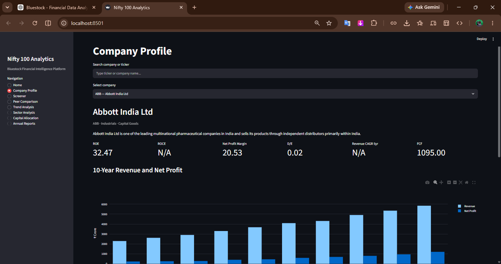
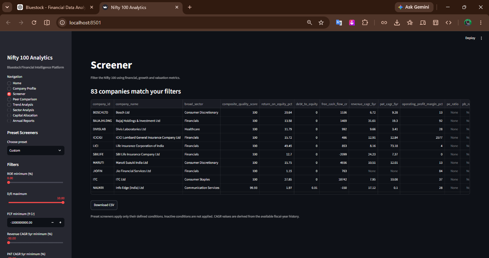
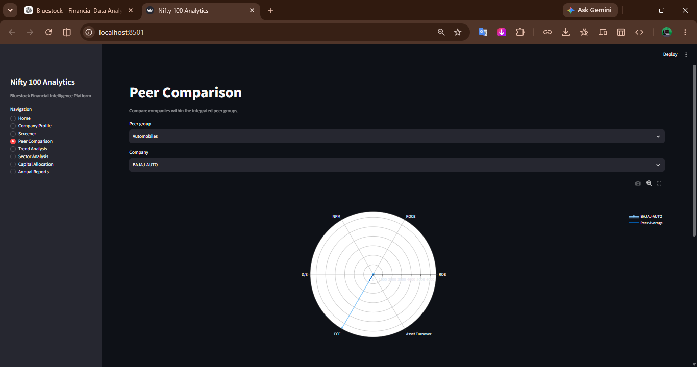
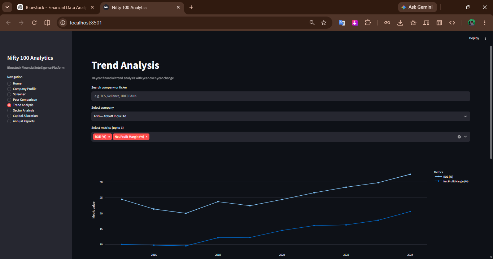
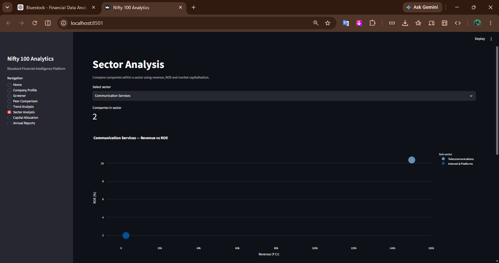
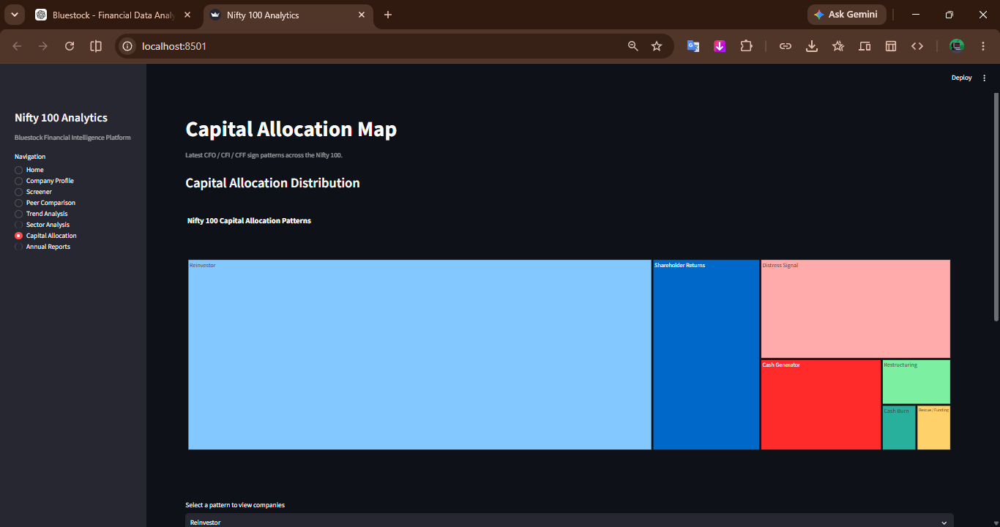
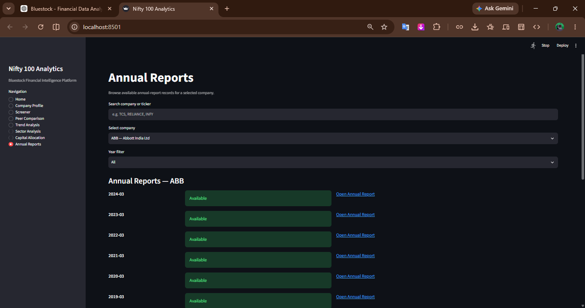

# Bluestock Financial Analytics

A Python-based financial analytics platform for ingesting, validating, analyzing, and visualizing financial data for companies in the NIFTY 100 universe.

The project combines an ETL pipeline, SQLite data warehouse, financial KPI calculations, stock analytics, company screening, peer comparison, REST APIs, and an interactive Streamlit dashboard.

## Project Overview

Bluestock Financial Analytics is designed to turn raw financial datasets into structured and decision-ready analytics.

### Main workflow

```text
Excel Source Data
       |
       v
ETL / Data Loading
       |
       v
Normalization & Validation
       |
       v
SQLite Database
       |
       +----------------------+
       |                      |
       v                      v
Financial Analytics       Data Quality Checks
       |
       +-------------------------------+
       |               |               |
       v               v               v
Screener        Peer Comparison    Stock Analytics
       |               |               |
       +---------------+---------------+
                       |
              +--------+--------+
              |                 |
              v                 v
          FastAPI          Streamlit
             API            Dashboard
```

## Key Features

### Data Engineering
- Excel-based financial data ingestion
- Data normalization and company ID standardization
- SQLite database creation and loading
- Foreign-key validation
- Duplicate and orphan-record checks
- Data quality validation across 16 DQ rules

### Financial Analytics
- Net Profit Margin
- Operating Profit Margin
- EBIT Margin
- Return on Equity (ROE)
- Return on Capital Employed (ROCE)
- Return on Assets (ROA)
- Debt-to-Equity
- Interest Coverage Ratio
- Asset Turnover
- Cash Flow analysis
- Free Cash Flow
- CFO/PAT and CFO/Sales
- Revenue CAGR
- PAT CAGR
- EPS CAGR
- Stock returns and volatility
- Drawdown analysis

### Company Screener
The screener supports financial-quality filters such as:
- ROE
- ROCE
- Operating Profit Margin
- CFO/Sales
- Debt-to-Equity
- Interest Coverage
- Revenue CAGR
- PAT CAGR
- Free Cash Flow

Preset screening strategies include:
- Quality Compounder
- Value Pick
- Growth Accelerator
- Dividend Champion
- Debt-Free Blue Chip
- Turnaround Watch

Financial-sector companies are handled separately where industrial leverage metrics are not appropriate.

### Peer Comparison
- Sector-based peer groups
- Benchmark company identification
- Financial KPI comparison
- Peer ranking
- Interactive comparison visualization

### Dashboard
The Streamlit dashboard includes:
- Home
- Company Profile
- Company Screener
- Peer Comparison
- Financial Trends
- Sector Analysis
- Capital Flow Analysis
- Annual Reports

### REST API
FastAPI endpoints are available for:
- Company information
- Financial statements
- Financial ratios
- Screener results
- Peer comparison
- Stock analytics
- CAGR analytics

## Technology Stack

| Category | Technologies |
|---|---|
| Language | Python |
| Data Processing | Pandas, NumPy |
| Database | SQLite |
| API | FastAPI |
| Dashboard | Streamlit |
| Visualization | Plotly |
| Testing | Pytest |
| Data Source | Excel |
| Version Control | Git, GitHub |

## Database

The project uses SQLite as the analytical database.

Core tables include:

```text
companies
profitandloss
balancesheet
cashflow
analysis
documents
prosandcons
sectors
market_cap
stock_prices
financial_ratios
peer_groups
```

Additional integration tables are created for analytics and dashboard/API consumption.

## Project Structure

```text
bluestock-financial-analytics/
|
├── data/
│   ├── raw/
│   └── supporting datasets/
|
├── src/
│   ├── analytics/
│   ├── api/
│   ├── dashboard/
│   │   ├── pages/
│   │   └── utils/
│   ├── etl/
│   └── screener/
|
├── tests/
│   ├── api/
│   ├── dq/
│   ├── etl/
│   ├── integration/
│   └── kpi/
|
├── .streamlit/
├── schema.sql
├── requirements.txt
├── pytest.ini
├── Makefile
└── README.md
```

## Data Quality

The ETL pipeline runs 16 data-quality rules covering areas such as:
- Required fields
- Duplicate records
- Foreign-key integrity
- Financial statement consistency
- Numeric validity
- Year validation
- Ratio validation
- URL validation
- Accounting reconciliation

The project treats critical data-quality failures separately from informational/source-data observations.

## Testing

The project includes unit, API, ETL, data-quality, KPI, and integration tests.

Latest project test status:

```text
193 passed
2 warnings
```

The warnings are dependency deprecation warnings and do not represent test failures.

Run the complete test suite with:

```powershell
pytest
```

## Installation

Clone the repository:

```powershell
git clone https://github.com/mohan-153/bluestock-financial-analytics.git
cd bluestock-financial-analytics
```

Create a virtual environment:

```powershell
python -m venv .venv
```

Activate it on Windows PowerShell:

```powershell
.\.venv\Scripts\Activate.ps1
```

Install dependencies:

```powershell
pip install -r requirements.txt
```

## Running the Project

### Load the database

```powershell
make load
```

### Run data-quality checks

```powershell
python -m src.etl.run_dq
```

### Run analytics

```powershell
make ratios
```

### Run tests

```powershell
make test
```

### Generate reports

```powershell
make report
```

### Start the dashboard

```powershell
make dashboard
```

### Start the API

```powershell
make api
```

## Dashboard Preview

### Home Dashboard

Provides a high-level overview of the NIFTY 100 dataset, including company count, ROE, debt-to-equity, sector distribution, and top-quality companies.



### Company Profile

Displays company-level financial metrics, historical revenue and net profit, profitability indicators, and other company information.



### Company Screener

Allows users to filter companies using profitability, leverage, cash-flow, growth, and other financial metrics.



### Peer Comparison

Compares companies within integrated peer groups using financial KPIs and interactive visualizations.



### Trend Analysis

Shows historical financial trends and year-over-year changes for selected companies and metrics.



### Sector Analysis

Provides sector-level comparison using revenue, ROE, market capitalization, and subsector information.



### Capital Allocation

Visualizes CFO, CFI, and CFF sign patterns to classify company capital-allocation behavior.



### Annual Reports

Allows users to browse available annual reports by company and financial year.


## API Endpoints

The FastAPI application provides endpoints including:

```text
GET /
GET /health
GET /companies
GET /companies/{company_id}
GET /financials/{company_id}
GET /ratios/{company_id}
GET /screener
GET /peers/{company_id}
GET /stock/{company_id}
GET /cagr/{company_id}
```

## Important Analytics Rules

Some project-specific rules include:

- Company IDs are normalized using trimming and uppercase conversion.
- Financial-sector companies are excluded from inappropriate industrial leverage screening.
- Debt-to-Equity is handled separately for financial-sector companies.
- Interest Expense = 0 is treated as Debt Free for the relevant leverage logic.
- Negative starting values are handled explicitly in CAGR calculations, including turnaround cases.
- Stock-price and market-cap data that are simulated are explicitly labelled as `SIMULATED`.
- Financial statement source data is not modified merely to remove source-data quality warnings.

## Portfolio Value

This project demonstrates practical skills in:

- Data Analyst workflows
- Financial data analysis
- Data cleaning and validation
- ETL development
- SQL and SQLite
- Python analytics
- KPI calculation
- Business screening
- REST API development
- Dashboard development
- Automated testing
- Git and GitHub

## Author

**Mohan P**

B.Sc. Computer Science Graduate

- GitHub: https://github.com/mohan-153
- LinkedIn: https://www.linkedin.com/in/mohan-p-776452ppmgkb/

## License

This project is intended for educational, portfolio, and demonstration purposes.
